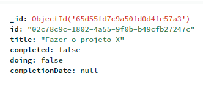

# Desafio Técnico: Aplicativo de Kanban com ReactJS e NodeJS

Este repositório contém o código-fonte para um aplicativo simples de Kanban, desenvolvido com ReactJS para o frontend e Node.js para o backend. O objetivo é permitir que os usuários gerenciem tarefas através das três colunas: "To Do", "Doing" e "Ready".

## Backend (Node.js com Express)

### Glossário

- 🔲 Atividade a ser elaborada.
- ✅ Atividade feita.
- ⚠️ Atividade feita com observações.
- ❌ Atividade não realizada.

### Requisitos:

- 🔲 Desenvolver uma API para criar, atualizar, mover e deletar tarefas.
- ✅ A API deve permitir a filtragem e ordenação de tarefas.
- ❌ Implementar autenticação básica (opcional, para candidatos visando posições mais avançadas).

### Banco de Dados:

- ✅ Utilizar uma das opções para armazenamento de dados: SQLite, Postgres, Mysql ou **Mongodb**.
- ✅ Projetar um esquema de banco de dados simples para gerenciar as tarefas e seu estado.

   

### Práticas de Desenvolvimento:

- ✅ Escrever código limpo e bem organizado, seguindo padrões de código.
- ✅ Implementar tratamento de erros e logging adequados.

### Como Executar o Backend:

1. Clone este repositório: `git clone https://github.com/laraberns/kanban-backend.git`
2. Instale as dependências: `npm install`
3. Inicie o servidor: `npm start`

A API estará disponível em [http://localhost:3002](http://localhost:3002) para interação com o frontend.

Sinta-se à vontade para explorar, contribuir e aprimorar este projeto!
